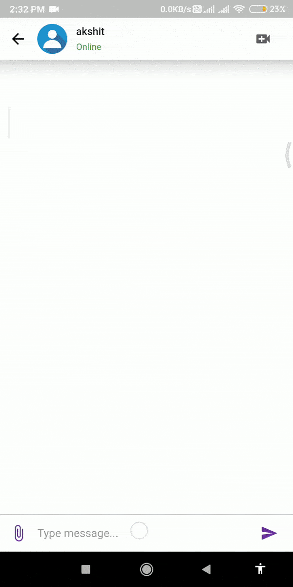
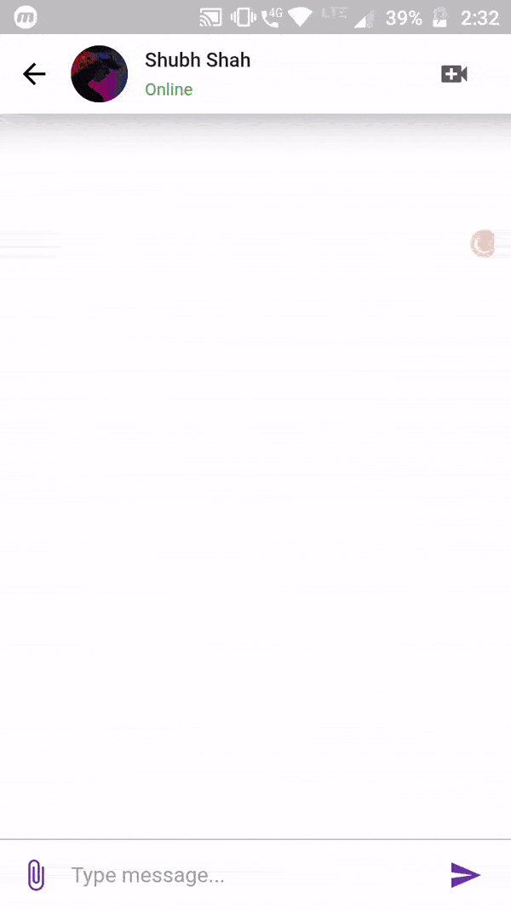
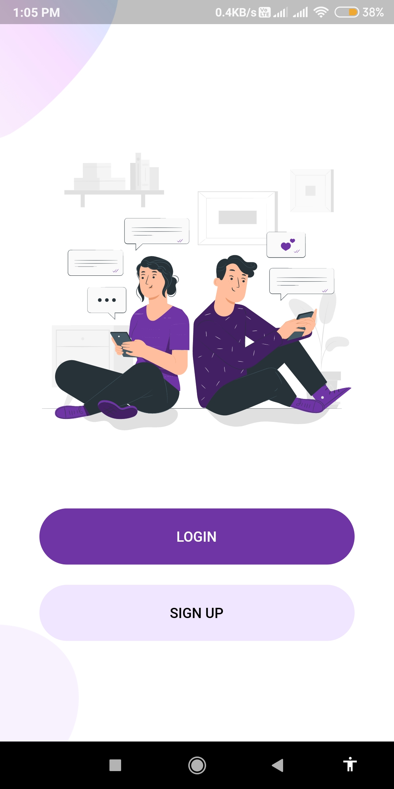
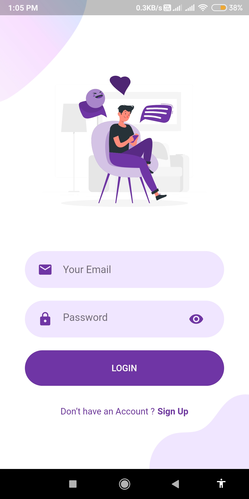
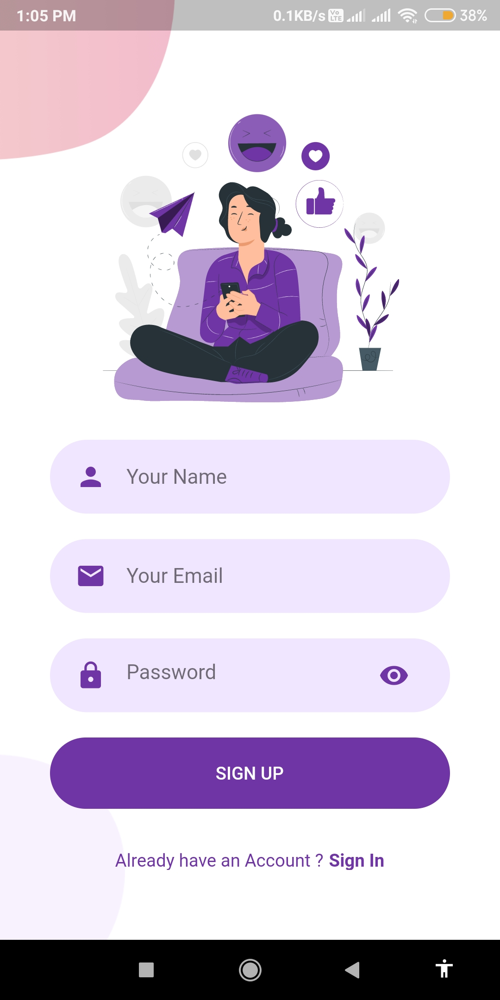
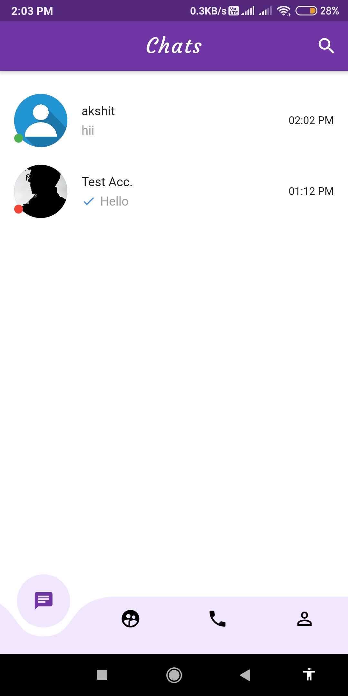
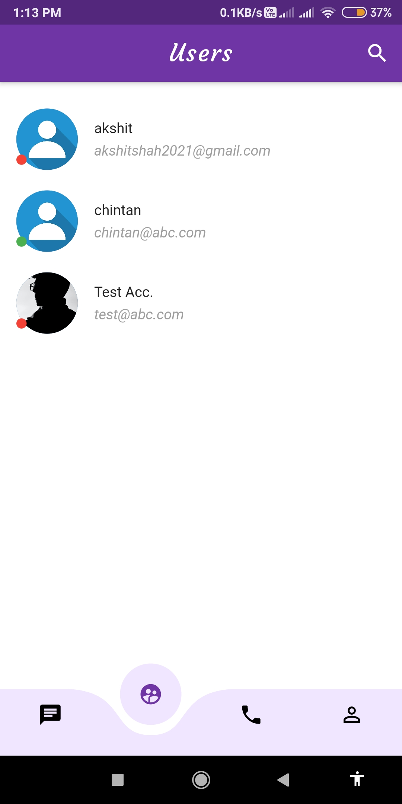
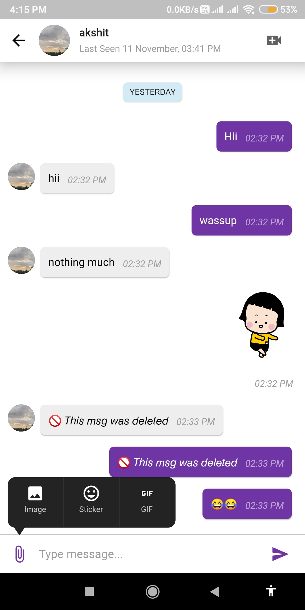

 

# chat app

Chat Application in flutter.

## Download Apk File from below

* <a href='https://drive.google.com/file/d/1joVvx4xqMh4QwJO0x4a4yDBKrdZwxqHU/view?usp=sharing'>app-arm64-v8a-release</a>
* <a href='https://drive.google.com/file/d/1t4xe6qeycCJXyYccBBhgXa9n27f34MtZ/view?usp=sharing'>app-armeabi-v7a-release</a>
* <a href='https://drive.google.com/file/d/1mZTFdGooTDk_9mKcN2cFDhBUtI6i0fDE/view?usp=sharing'>app-x86_64-release</a>

## Features

* 用户认证
* 实时聊天
* 文本/图片发送
* 永久删除消息
* 查看最近聊天
* 查看用户状态
* 通知新消息

## Demo

<h4 align="center">Chatting Page</h4>

 

<h4 align="center">Welcome Screen &nbsp&nbsp&nbsp&nbsp | &nbsp&nbsp&nbsp&nbsp Login Screen &nbsp&nbsp&nbsp&nbsp | &nbsp&nbsp&nbsp&nbsp Signup Screen</h4>

<h4 align="center">Recent Chats Screen &nbsp&nbsp&nbsp&nbsp | &nbsp&nbsp&nbsp&nbsp Users List Screen &nbsp&nbsp&nbsp&nbsp | &nbsp&nbsp&nbsp&nbsp Chat Screen</h4>

